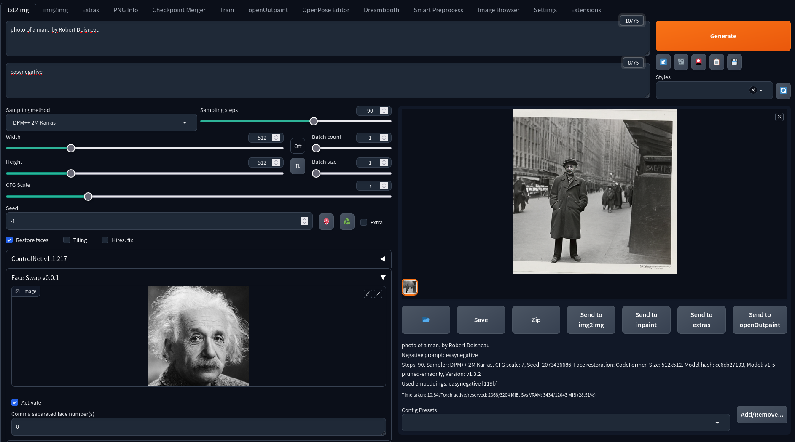

# FaceSwap Extension - Automatic 1111 - Proof of Concept

This repository contains a quick and dirty proof of concept inspired by [roop](https://github.com/s0md3v/roop) and using [insightface](https://github.com/deepinsight/insightface), allowing you to swap faces in images generated by stable diffusion.

The main objective of this extension is to enable face swapping for single images in stable diffusion.

To ensure compatibility, this extension currently runs only on CPU. However, it can be easily ported to GPU for improved performance.

**Ethical viewpoint :** The primary purpose of this extension is to facilitate consistency in generated images by enabling face swapping. It is important to note that this extension does not implement censorship features. While censorship mechanisms can be implemented (as does roop), they are inherently vulnerable to bypass when users have access to the source code. Therefore, it is crucial to use this extension responsibly and refrain from utilizing it for malicious purposes. We strongly emphasize the ethical use of this extension. Please respect the privacy and consent of individuals when swapping faces in images. Do not engage in activities that may cause harm, violate privacy rights, or infringe upon the well-being of others. 

## Install

To install the extension, follow these steps:

+ Clone the repository to your automatic 1111 extensions directory.
+ Download the pre-trained model used by "Roop" and place it in the models directory of this extension. The model file required is "inswapper_128.onnx".Mirrors are given the roop project [installation guide](https://github.com/s0md3v/roop/wiki/1.-Installation).

On Windows, Microsoft Visual C++ 14.0 or greater is required. [During the install, make sure to include the Python and C++ packages.](https://github.com/s0md3v/roop/issues/153)

# Usage

To use the FaceSwap extension, follow these instructions:

1. In the face swap box, import an image containing a face.
2. Click on the "Activate" before generate.
3. Optionally, select the face number you wish to swap (from right to left) if multiple faces are detected in the image.
4. The resulting swapped face will be displayed.
5. If the quality is not satisfactory (and it is often quite average), you can try using the "Restore Face" feature or explore additional options in the "Extra" tab for further improvement.

Img2Img should work but only the masked part will be swapped.
